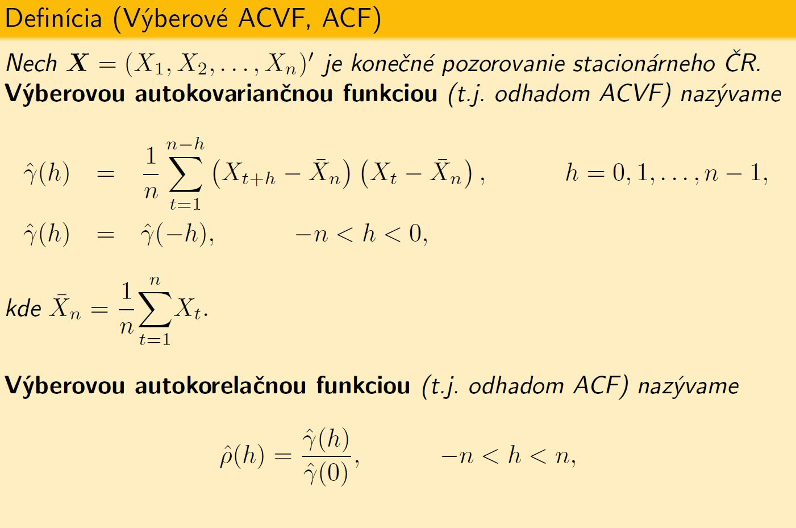

---
title: "WN a výberová ACF"
output: html_document
---

Pomocou výberovej ACF v praxi rozhodujeme, či získané reziduá už možno považovať za WN. Ak áno, už ich neviem použiť na predpoveď budúcich hodnôt. Ak nie, tak ich previazanosť využijeme na vylepšenie predikcie.

####Úloha
Vygenerujte 100 hodnôt $\mathrm{WN}\sim \mathrm{N}(0,\sigma^2)$
```{r fig.width=9}
n<-100
noise<-rnorm(n,0,1)
plot(noise, type="o")
abline(0,0)
```

Získali sme realizáciu ČR. Predpokladajme, že nevieme, o aký typ dát ide. Teda teoretickú ACF spočítať nevieme. Máme len realizáciu, nemáme náhodné veličiny, z ktorých možno počítať teoretickú koreláciu, nevieme rozdelenie dát, resp. parametre rozdelenia. 

Musíme teda použiť odhad - teda výberovú ACF:



