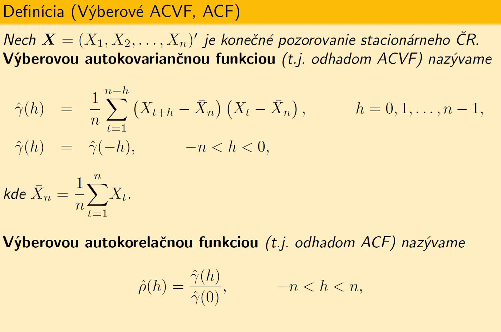
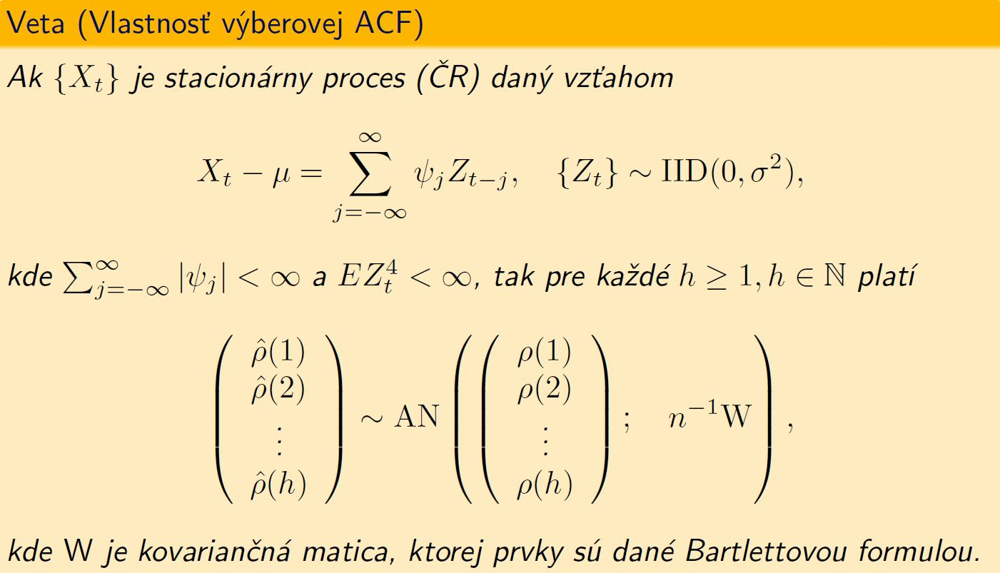
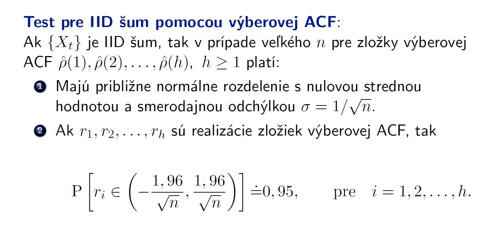

Pomocou výberovej ACF v praxi rozhodujeme, či získané reziduá už možno považovať za WN. Ak áno, už ich neviem použiť na predpoveď budúcich hodnôt. Ak nie, tak ich previazanosť využijeme na vylepšenie predikcie.

####Úloha
Vygenerujte 100 hodnôt $\mathrm{WN}\sim \mathrm{N}(0,\sigma^2)$
```{r fig.width=9}
n<-100
noise<-rnorm(n,0,1)
plot(noise, type="o")
abline(0,0)
```


Získali sme realizáciu ČR. Predpokladajme, že nevieme, o aký typ dát ide. Teda teoretickú ACF spočítať nevieme. Máme len realizáciu, nemáme náhodné veličiny, z ktorých možno počítať teoretickú koreláciu, nevieme rozdelenie dát, charakteristky rozdelenia resp. parametre rozdelenia. 

Musíme teda použiť odhad - teda výberovú ACF:



####Výpočet a zobrazenie výberovej ACF v R
V R na výpočet a zobrazenie výberovej ACF z nameraných dát slúži príkaz acf().
```{r}
acf <- acf(noise,40)
```

Očakávame, že hodnoty pre $h > 1$ budú nulové ale nie sú lebo výberová ACF je počítaná z konečného počtu nameraných dát. V limite však bude konvergovať ku skutočnej ACF, o čom hovorí aj veta z prednášky:




Na základe toho sme sformulovali test pre IID proces: 



**IID test:** Empirické pravidlo nám hovorí, že treba zobrať aspoň 40 hodnôt a 5% z nich môže vybehnúť z intervalu (pre 40 hodnôt to sú 2 zlé).

Testujeme nulovú hypotézu: **dáta sú biely šum**?